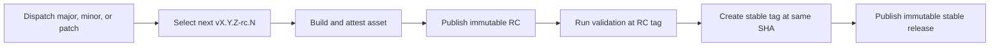

# Immutable action release demo

This repository demonstrates a staged GitHub action release. A dispatch selects
a version bump, publishes an immutable release candidate (RC), validates the
action at the candidate commit, and publishes the verified asset as an
immutable stable release.

> [!IMPORTANT]
> In repository settings, go to the "Releases" section and select
> **Enable release immutability** before running the workflow. The setting
> applies only to future releases.



## Release guarantees

| Guarantee | How |
| --- | --- |
| Serialized version selection | One `release` concurrency group |
| Predictable versions | Latest stable tag plus `major`, `minor`, or `patch`; existing RC tags increment `rc.N` |
| Exact source under test | Validation is dispatched at the RC tag and invokes `uses: $/` without checking out a workspace |
| Protected tags | Tags are created once without force; a repository ruleset blocks updates and deletion |
| Immutable publication | Releases are drafted, assets attached, then published with release immutability enabled |
| Build provenance | GitHub artifact attestation binds the archive to its source workflow and commit |
| Promotion without rebuilding | The verified RC asset is downloaded and attached to the stable release |
| Least privilege | Each job declares only the permissions it needs |
| Pinned dependencies | `actions.lock` pins workflow action versions |

## Run a release

Open the [Release workflow](../../actions/workflows/release.yml), select
`patch`, `minor`, or `major`, then run it from `main`.

If the latest stable tag is `v1.4.2`, a minor release starts with
`v1.5.0-rc.1`. If candidate validation fails, the published prerelease remains
as an audit record and the next minor release uses `v1.5.0-rc.2`. Only a
candidate that passes validation is published as `v1.5.0`.

## Why validation runs separately

`release.yml` is the human entry point. After publishing an RC, it starts
`release-test.yml` through the workflow dispatch API at the generated tag and
waits for that specific run. The validation workflow declares
`workflow_dispatch` so the API can start it at a dynamic ref.

A reusable workflow call cannot replace this step because GitHub Actions does
not allow expressions in `uses:`. The candidate tag therefore cannot be passed
to `jobs.<job_id>.uses`. Inside the dispatched candidate run, `$/` resolves the
action from the workflow's exact running commit.

## Verify a release

```bash
gh release verify v0.1.1 --repo nodeselector/actions-release-demo
gh release download v0.1.1 --repo nodeselector/actions-release-demo
gh release verify-asset v0.1.1 actions-release-demo-v0.1.1.tar.gz \
  --repo nodeselector/actions-release-demo
gh attestation verify actions-release-demo-v0.1.1.tar.gz \
  --repo nodeselector/actions-release-demo
```

See GitHub's documentation for
[immutable releases](https://docs.github.com/en/code-security/concepts/supply-chain-security/immutable-releases)
and [release verification](https://docs.github.com/en/code-security/how-tos/secure-your-supply-chain/secure-your-dependencies/verify-release-integrity).

## Live proof

| Artifact | Evidence |
| --- | --- |
| Full release pipeline | [Patch release run](https://github.com/nodeselector/actions-release-demo/actions/runs/33664342318) |
| Exact-tag `$/` execution | [RC validation run](https://github.com/nodeselector/actions-release-demo/actions/runs/33664386924) |
| Immutable candidate | [`v0.1.1-rc.1`](https://github.com/nodeselector/actions-release-demo/releases/tag/v0.1.1-rc.1) |
| Immutable stable release | [`v0.1.1`](https://github.com/nodeselector/actions-release-demo/releases/tag/v0.1.1) |
| Server-enforced tag protection | [Immutable release tag ruleset](https://github.com/nodeselector/actions-release-demo/rules/22130912) |
