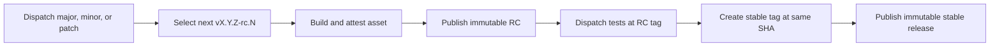

# Secure release candidate demo

This repository models a real action release without hard-coding a dynamic ref
in `uses:`. A dispatch selects a semantic-version bump; the pipeline publishes
an immutable candidate, validates the action at that exact candidate commit
through `$/`, then promotes the same verified asset to an immutable stable
release.

> [!IMPORTANT]
> Enable **Settings → General → Releases → Enable release immutability** before
> running this workflow. GitHub applies the setting only to future releases.



## Release guarantees

| Guarantee | How |
| --- | --- |
| Serialized version selection | One `release` concurrency group |
| Predictable versions | Latest stable tag plus `major`, `minor`, or `patch`; RCs increment independently |
| Exact source under test | Validation workflow is dispatched at the RC tag and invokes `uses: $/` |
| No tag rewriting | Tags are created once without force; a repository ruleset blocks updates and deletion |
| Immutable publication | Releases are drafted, assets attached, then published with release immutability enabled |
| Build provenance | GitHub artifact attestation binds the archive to its source workflow and commit |
| Promotion without rebuilding | The verified RC asset is downloaded and attached to the stable release |
| Least privilege | Each job declares only the permissions it needs |
| Dependency determinism | `actions.lock` pins workflow dependencies |

## Run a release

Open [**Actions → Release**](../../actions/workflows/release.yml), choose
`patch`, `minor`, or `major`, and run the workflow from `main`.

If the latest stable release is `v1.4.2`, a minor dispatch selects
`v1.5.0-rc.1`. A failed attempt leaves that immutable candidate as an audit
record; the next minor dispatch selects `v1.5.0-rc.2`. Only a candidate that
passes exact-tag validation is published as `v1.5.0`.

## Why dispatch instead of `jobs.<job_id>.uses`

GitHub Actions does not allow expressions in `uses:`, so a caller cannot write
`uses: owner/repository/workflow.yml@${{ needs.release.outputs.tag }}`. The
release workflow instead dispatches the validation workflow at the generated
RC tag and waits for that correlated run. Inside the candidate run, `$/`
resolves the action from the workflow's exact running commit.

## Verify a release

```bash
gh release verify v1.5.0 --repo nodeselector/actions-release-demo
gh release download v1.5.0 --repo nodeselector/actions-release-demo
gh release verify-asset v1.5.0 actions-release-demo-v1.5.0.tar.gz \
  --repo nodeselector/actions-release-demo
gh attestation verify actions-release-demo-v1.5.0.tar.gz \
  --repo nodeselector/actions-release-demo
```

See GitHub's documentation for
[immutable releases](https://docs.github.com/en/code-security/concepts/supply-chain-security/immutable-releases)
and [release verification](https://docs.github.com/en/code-security/how-tos/secure-your-supply-chain/secure-your-dependencies/verify-release-integrity).
